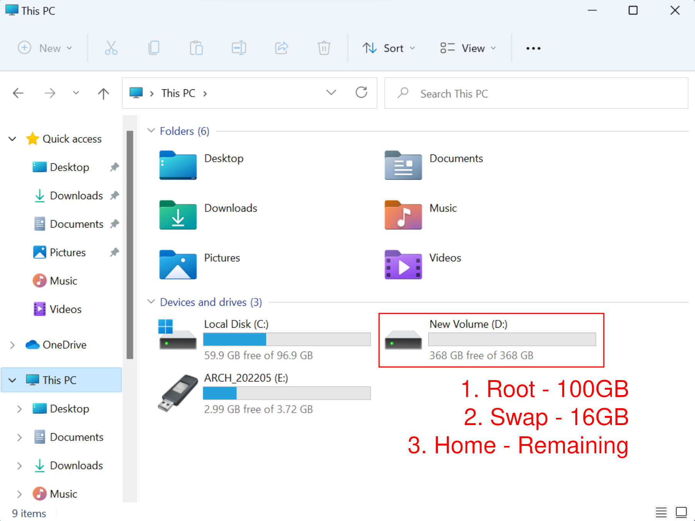
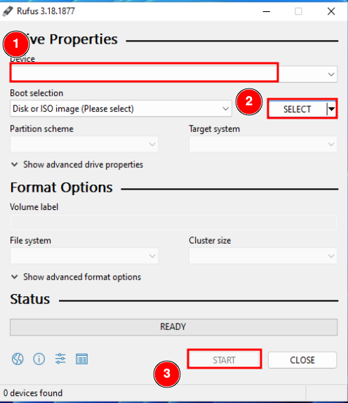
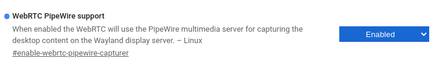
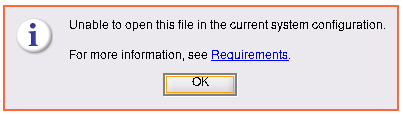

# Dual Booting Arch Linux with Windows

## Base System Installation

### Windows 11 System
* We will format the D drive into Linux partition

    

* We will partition it into three different partitions
    1. Root - 100GB
    2. Swap - 16GB
    3. Home - Remaining space

### Preparing Bootable USB
* Download Arch Linux ISO from [here](https://archlinux.org/download/)
* Download Rufus from [here](https://rufus.ie/en/)
* Create bootable USB using Rufus

    

### Disable Secure Boot from BIOS
* Read more from [Installation
  Guide](https://wiki.archlinux.org/title/Installation_guide#Boot_the_live_environment).

### Boot into Live USB
* Restart and boot into the USB create
* Wait until we have
    > root@archiso ~ #

### Partitioning
* Check the partitions using fdisk:
    > root@archiso ~ # fdisk -l
    
    We will see

		Device         Start     End       Sectors   Size   Type                        
		/dev/nvme0n1p1 2048      206847    204800    100M   EFI System                  
		/dev/nvme0n1p2 206848    239615    32768     16M    Microsoft reserved          
		/dev/nvme0n1p3 239616    203548671 203309056 96.9G  Microsoft basic data        
		/dev/nvme0n1p4 203548672 204799999 1251328   611M   Windows recovery environment
		/dev/nvme0n1p5 204800000 976773119 771971072 368.1G Microsoft basic data        

* fdisk into the drive (/dev/nvme0n1 in this case):
	> root@archiso ~ # fdisk /dev/nvme0n1

		Welcome to fdisk (util-linux 2.38).
		Changes will remain in memory only, until you decide to write them.
		Be careful before using the write command.
		
		Command (m for help):

* Delete the D drive (partition 5):
    > Command (m for help): d
	> Partition number (1-5, default 5): 5

		Partition 5 has been deleted

* Create three new partitions (root, swap and home) from the space we just deleted:
    > Command (m for help): n 
	> Partition number (5-128, default 5): 
	> First sector (204800000-976773134, default 204800000): 
	> Last sector, +/-sectors or +/-size{K,M,G,T,P} (204800000-976773134, default 976773119): +100G

		Created a new partition 5 of type 'Linux filesystem' and of size 100 GiB.

    > Command (m for help): n 
	> Partition number (6-128, default 6): 
	> First sector (414515200-976773134, default 414515200): 
	> Last sector, +/-sectors or +/-size{K,M,G,T,P} (414515200-976773134, default 976773119): +16G

		Created a new partition 6 of type 'Linux filesystem' and of size 16 GiB.

    > Command (m for help): n 
	> Partition number (7-128, default 7): 
	> First sector (448069632-976773134, default 448069632): 
	> Last sector, +/-sectors or +/-size{K,M,G,T,P} (448069632-976773134, default 976773119):

		Created a new partition 7 of type 'Linux filesystem' and of size 252.1 GiB.

* View the partition table:
    > Command (m for help): p 
        
        Device             Start       End   Sectors   Size Type
        /dev/nvme0n1p1      2048    206847    204800   100M EFI System
        /dev/nvme0n1p2    206848    239615     32768    16M Microsoft reserved
        /dev/nvme0n1p3    239616 203548671 203309056  96.9G Microsoft basic data
        /dev/nvme0n1p4 203548672 204799999   1251328   611M Windows recovery environment
        /dev/nvme0n1p5 204800000 414515199 209715200   100G Linux filesystem
        /dev/nvme0n1p6 414515200 448069631  33554432    16G Linux filesystem
        /dev/nvme0n1p7 448069632 976773119 528703488 252.1G Linux filesystem

* Change the filesystem type:
    > Command (m for help): t 
	> Partition number (1-7, default 7): 5 
    > Partition type or alias (type L to list all): 23

		Changed type of partition 'Linux filesystem' to 'Linux root (x86-64)'.

    > Command (m for help): t 
	> Partition number (1-7, default 7): 6 
    > Partition type or alias (type L to list all): 19

		Changed type of partition 'Linux filesystem' to 'Linux swap'.

    > Command (m for help): t 
	> Partition number (1-7, default 7): 7 
    > Partition type or alias (type L to list all): 41

		Changed type of partition 'Linux filesystem' to 'Linux home'.

* Write the changes to disk:
    > Command (m for help): w 
        
        The partition table has been altered.
        Calling ioctl() to re-read partition table.
        Syncing disks.

* Check that all partitions are correct:
    > root@archiso ~ # fdisk -l

        Device             Start       End   Sectors   Size Type
        /dev/nvme0n1p1      2048    206847    204800   100M EFI System
        /dev/nvme0n1p2    206848    239615     32768    16M Microsoft reserved
        /dev/nvme0n1p3    239616 203548671 203309056  96.9G Microsoft basic data
        /dev/nvme0n1p4 203548672 204799999   1251328   611M Windows recovery environment
        /dev/nvme0n1p5 204800000 414515199 209715200   100G Linux root (x86-64)
        /dev/nvme0n1p6 414515200 448069631  33554432    16G Linux swap
        /dev/nvme0n1p7 448069632 976773119 528703488 252.1G Linux home

* Format root and home partitions:
    > root@archiso ~ # mkfs.ext4 /dev/nvme0n1p5 
    > root@archiso ~ # mkfs.ext4 /dev/nvme0n1p7 

* Format swap partition:
    > root@archiso ~ # mkswap /dev/nvme0n1p6 
    > root@archiso ~ # swapon /dev/nvme0n1p6 

* Mount partitions (note that we mount the EFI partition at /mnt/efi)
    > root@archiso ~ # mount /dev/nvme0n1p5 /mnt 
    > root@archiso ~ # mount --mkdir /dev/nvme0n1p1 /mnt/efi 
    > root@archiso ~ # mount --mkdir /dev/nvme0n1p7 /mnt/home 

### Connect to WiFi
* Connect to WiFi using iwctl:
    > root@archiso ~ # iwctl 
    > [iwd]# station list 
                                
                                Devices in Station Mode
        -----------------------------------------------------------------------
          Name          State           Scanning
        -----------------------------------------------------------------------
          wlan0         disconnected
    > [iwd]# station wlan0 scan 
    > [iwd]# station wlan0 get-networks 
                                
                                Available networks
        -----------------------------------------------------------------------
            Network name            Security            Signal
        -----------------------------------------------------------------------
          > Fermat                  psk                 ****
            chew                    psk                 ****
    > [iwd]# station wlan0 connect Fermat
        
        Type the network passphrase for Fermat psk.
        Passphrase: ********
    
    > [iwd]# exit

### Installation and Basic Setup
* Installation using pacstrap
    > pacstrap /mnt base linux linux-firmware vim neovim
    
* Generate fstab file:
    > root@archiso ~ # genfstab -U /mnt >> /mnt/etc/fstab
        
* Check if all partitions are mounted correctly:
    > root@archiso ~ # cat /mnt/etc/fstab

        # /dev/nvme0n1p5
        UUID=52e7d1da-1c6c-4466-baa7-a5244a1be306	/         	ext4      	rw,relatime	 0 1

        # /dev/nvme0n1p7
        UUID=84dea383-0c98-4db2-86d8-36c8fa8999a9	/home     	ext4      	rw,relatime	 0 2

        # /dev/nvme0n1p1
        UUID=6084-CFB8      	/efi      	vfat      	rw,relatime,fmask=0022,dmask=0022,codepage=437,iocharset=ascii,shortname=mixed,utf8,errors=remount-ro	 0 2

        # /dev/nvme0n1p6
        UUID=ea490bac-cc6d-48ff-b1dd-53c300fa578d	none      	swap      	defaults  	 0 0

* chroot:
    > root@archiso ~ # arch-chroot /mnt

* Setting locale (uncomment en_US.UTF-8 UTF-8) and Time Zone:
    > root@archiso ~ # nvim /etc/locale.gen
        
        ...
        #en_SG ISO-8859-1
        en_US.UTF-8 UTF-8
        #en_US ISO-8859-1
        ...
    > locale-gen
    
        Generating locales...
          en_US.UTF-8... done
        Generation complete.
        
    > echo "LANG=en_US.UTF-8" > /etc/locale.conf

        ln -sf /usr/share/zoneinfo/Asia/Kuala_Lumpur /etc/localtime
        
* Setting hostname and root password
    > root@archiso ~ # echo "chew-pc" > /etc/hostname 
    > root@archiso ~ # passwd
    
        New password:
        Retype new password:
        passwd: password updated successfully
        
* Configure network (edit /etc/hosts as some software may need this. See [here](https://wiki.archlinux.org/title/Network_configuration)):
    > root@archiso ~ # nvim /etc/hosts
        
        127.0.0.1        localhost
        ::1              localhost
        127.0.1.1        chew-pc

### Boot Loader
* For dual boot with Windows, install grub, os-prober and uncomment the following line in /etc/default/grub:
    > pacman -S grub efibootmgr os-prober 
    > nvim /etc/default/grub
        
        ...
        # Probing for other operating systems is disabled for security reasons. Read
        # documentation on GRUB_DISABLE_OS_PROBER, if still want to enable this
        # functionality install os-prober and uncomment to detect and include other
        # operating systems.
        GRUB_DISABLE_OS_PROBER=false

* Install grub:
    > grub-install --efi-directory=/efi 
    > grub-mkconfig -o /boot/grub/grub.cfg

* Software installation (and/or any other software that you wish to install now):
    > root@archiso ~ # pacman -S net-tools networkmanager dhcpcd wireless_tools

* Enable the Network Manager:
    > root@archiso ~ # systemctl enable NetworkManager

* Enable the Dynamic Host Configuration Protocol (DHCP):
    > root@archiso ~ # systemctl enable dhcpcd

## Add user
* Add user(s):
    > root@archiso ~ # useradd -m -g users -G wheel,storage,power,video -s /bin/bash chew 
    > root@archiso ~ # passwd chew

        New password:
        Retype new password:
        passwd: password updated successfully
        
* Install sudo and edit visudo (for user to act as su):
    > root@archiso ~ # pacman -S sudo 
    > root@archiso ~ # EDITOR=nvim visudo
        
        ...
        ## Uncomment to allow members of group wheel to execute any command
        # %wheel ALL=(ALL:ALL) ALL
        
        ## Same thing without a password
        # %wheel ALL=(ALL:ALL) NOPASSWD: ALL
        ...

* Uncomment the row "# %wheel ALL=(ALL:ALL) ALL" to:
        
        ...
        ## Uncomment to allow members of group wheel to execute any command
        %wheel ALL=(ALL:ALL) ALL
        
        ## Same thing without a password
        # %wheel ALL=(ALL:ALL) NOPASSWD: ALL
        ...

* Exit from chroot:
    > root@archiso ~ # exit

* Unmount /mnt and shutdown:
    > root@archiso ~ # umount -l /mnt 
    > root@archiso ~ # shutdown now

* Remove USB drive
        
## Installing SwayWM

### Login and Basic Software Installation
* Power on your machine 
* You should see GRUB screen after powering up
* Choose Arch Linux and login to your user account
* Basic Compiler and Linux Headers:
    > sudo pacman -S base-devel linux-headers
* Pacman Scripts:
    > sudo pacman -S pacman-contrib
* Other Tools:
    > sudo pacman -S python-pip git wget
* Intel graphics:
    > sudo pacman -S mesa intel-media-driver libva-utils
* Install polkit to allow users to shutdown (See
  [here](https://wiki.archlinux.org/title/Allow_users_to_shutdown)):
    > sudo pacman -S polkit
* Yay AUR Helper (See [here](https://github.com/Jguer/yay)):
    > git clone https://aur.archlinux.org/yay.git 
    > cd yay 
    > makepkg -si

### SwayWM and Applications
* SwayWM and some relevant software:
    > sudo pacman -S sway swayidle xorg-server-xwayland qt5-wayland waybar light wl-clipboard
    > yay -S swaylock-effects
* Application launcher:
    > yay -S rofi-lbonn-wayland-git
* EWW Widget:
    > yay -S eww-wayland-git
* System monitor:
    > sudo pacman -S htop intel-gpu-tools
* ALSA and PulseAudio:
    > sudo pacman -S alsa-firmware alsa-utils pulseaudio pulseaudio-alsa pavucontrol pamixer
* Bluetooth:
    > sudo pacman -S bluez bluez-utils pulseaudio-bluetooth
* Fonts:
    > sudo pacman -S ttf-roboto ttf-roboto-mono ttf-ubuntu-font-family ttf-font-awesome wqy-zenhei wqy-bitmapfont wqy-microhei wqy-microhei-lite
* Screenshot and screencast
    > sudo pacman -S grim slurp wf-recorder flameshot
* Office-suites and LaTex:
    > sudo pacman -S wps-office wps-office-mime ttf-wps-fonts texlive-most
* PDF readers and editor:
    > sudo pacman -S zathura zathura-djvu zathura-pdf-mupdf evince xournalpp ghostscript
    > yay -S masterpdfeditor-free
* Input method - fcitx5:
    > sudo pacman -S fcitx5 fcitx5-qt fcitx5-gtk fcitx5-chinese-addons fcitx5-configtool fcitx5-material-color
* CUPS and printer configuration
    > sudo pacman -S system-config-printer cups
* File manager:
    > sudo pacman -S thunar thunar-volman ntfs-3g gvfs gvfs-mtp polkit-gnome
    > sudo pacman -S ranger perl-file-mimeinfo xdg-utils
    > yay -S lf
* Zip and unzip:
    > sudo pacman -S zip unzip
* Browsers:
    > sudo pacman -S firefox qutebrowser pdfjs npm
* Cloud storage:
    > yay -S onedrive-abraunegg dropbox
* Notification and calendar:
    > sudo pacman -S mako zenity
* Image, music and video player:
    > sudo pacman -S imv mpc mpv youtube-dl mpd ncmpcpp 
    > systemctl --user enable mpd.service 
    > systemctl --user start mpd.service
* Simple calculator:
    > qalculate-gtk
* Powershell
    > yay -S powershell-bin
* Theme:
    > sudo pacman -S adapta-gtk-theme lxappearance
    > yay -S la-capitaine-icon-theme nwg-look
* TUI Typing Speed Tester:
    > yay -S typioca-git

## Screen Sharing with Chromium
* For online meeting purposes, screen sharing is important:
    > sudo pacman -S chromium libpipewire02 pipewire pipewire-media-session xdg-desktop-portal-wlr
* Ensure that the following environment variables are set:
        
        XDG_CURRENT_DESKTOP=sway
        XDG_SESSION_TYPE=wayland
* Change WebRTC Pipewire support to enabled in Chromium flags:
    * Type the following in Chromium URL bar:
        > chrome://flags
    * Search for WebRTC Pipewire and enable it:
        
        

## Raw Disk Access (Windows Partition) with VirtualBox:
* Ensure that xwayland is enabled in Sway config file:
        
        ...
        xwayland enable
        ...

* Install VirtualBox:
    > sudo pacman -S virtualbox
* Create image file using current windows partition:
    > VBoxManage internalcommands createrawvmdk -filename /home/chew/Documents/9_VirtualBox/win11.vmdk -rawdisk /dev/nvme0n1 -partitions 1,2,3 -relative
    

## Matlab
### Installation
* Mount ISO file and install using input file:
    > sudo mount -o loop /home/chew/R2021a/Matlab.iso ~/mnt/ 
    > cd /home/chew/mnt/ 
    > sudo bash ./install -v -inputFile /home/chew/matlab_input.txt -agreeToLicense yes

        fileInstallationKey=xxxxx-xxxxx-xxxxx-xxxxx-xxxxx-xxxxx

        #product.Computer_Vision_System_Toolbox
        #product.Control_System_Toolbox
        ...

* To insert license file during first time launching Matlab, I logged into X
  (instead of Wayland) for this. I am using X for presentation as well, as
  output mirroring is more convenient for me during presentation.

* Install the following if Matlab is not running (some may not be needed):
    > sudo pacman -S jre8-openjdk jdk8-openjdk jre8-openjdk-headless
    > yay -S libselinux

### Unable to launch MATLABWindow application
* Run the following commands in Matlab:
    > cd(matlabroot)
    > ! bin/glnxa64/MATLABWindow
        
        bin/glnxa64/MATLABWindow: symbol lookup error: /usr/lib/libcairo.so.2: undefined symbol: FT_Get_Color_Glyph_Layer
        
* Move libfreetype.so.6 to another folder:
    > cd /usr/local/Polyspace/R2021a/bin/glnxa64/ 
    > sudo mkdir exclude 
    > sudo mv ./libfreetype.so.6* ./exclude

* Doing this solved my issue of not able to launch live script as well.
    * Not currently supported by this operating system configuration (see
      [here](https://wiki.archlinux.org/title/MATLAB#LiveScript_errors) for more details):
    <!---
        
    --->

* See
  [1](https://es.mathworks.com/matlabcentral/answers/364551-why-is-matlab-unable-to-run-the-matlabwindow-application-on-linux),
  [2](https://www.reddit.com/r/archlinux/comments/tkas9q/matlab_stopped_working_after_system_update/)
  and
  [3](https://wiki.archlinux.org/title/MATLAB#Unable_to_launch_the_MATLABWindow_application)
  for more details.
* In my case, the following was solve by
        
        error while loading shared libraries: libcrypt.so.1: cannot open shared object file: No such file or directory
        
    > sudo pacman -S libxcrypt-compat

## Zsh and Oh My Zsh
### Zsh
* Install zsh:
    > sudo pacman -S zsh
* Change default shell to zsh:
    > chsh -l
    
        /bin/sh
        /bin/bash
        /usr/bin/git-shell
        /usr/bin/pwsh
        /bin/zsh
        /usr/bin/zsh

    > chsh -s /usr/bin/zsh
    
        Changing shell for chew.
        Password:
        Shell changed.
* Zsh configuration
    > autoload -Uz zsh-newuser-install
    > zsh-newuser-install -f
* Logout and login again

### Oh My Zsh
* Install Oh My Zsh and recommended font:
    > yay -S oh-my-zsh-git ttf-meslo-nerd-font-powerlevel10k
* Install theme powerlevel10k:
    > sudo pacman -S zsh-theme-powerlevel10k
* Copy oh-my-zsh folder to home:
    > cp -r /usr/share/oh-my-zsh /home/chew/.oh-my-zsh
* Theme configuration:
    > nvim ~/.zshrc
    
        ...
        export ZSH="/home/chew/.oh-my-zsh"
        source $ZSH/oh-my-zsh.sh
        source /usr/share/zsh-theme-powerlevel10k/powerlevel10k.zsh-theme
        ...

* Start terminal and begin configuration of powerlevel10k theme.
* Move the line 'bindkey -v' in .zshrc to last line (to ensure vim-like keybind
  is not overwritten by other plugins/themes).

## XMonad
* Install clipboard, picom, notification, lock-screen
    > sudo pacman -S xclip picom dunst i3lock
* Install cava
    > yay -S cava

## MX Master 3 - Logiops
### Installation
* Install logiops:
    > yay -S logiops
* Enable logid.service:
    > systemctl enable logid.service
    > systemctl start logid.service

### Configuration 
* Edit (or create) /etc/logid.cfg
* Get device name:
    > sudo logid -v
    
        ...
        [INFO] Detected receiver at /dev/hidraw10
        [DEBUG] Unsupported device /dev/hidraw8 ignored
        [DEBUG] Unsupported device /dev/hidraw4 ignored
        [DEBUG] Unsupported device /dev/hidraw0 ignored
        [INFO] Detected receiver at /dev/hidraw3
        [INFO] Device Wireless Mouse MX Master 3 not configured, using default config.
        [INFO] Device found: Wireless Mouse MX Master 3 on /dev/hidraw10:1
        [DEBUG] /dev/hidraw10:1 remappable buttons:
        ...

### Note
* In my case of connecting laptop to docking station with lid closed, every time I exit SwayWM, the external monitor goes off as well. To deal with this:
    > sudo nvim /etc/systemd/logind.conf
    
        [Login]
        ...
        HandleLidSwitch=ignore
        ...
